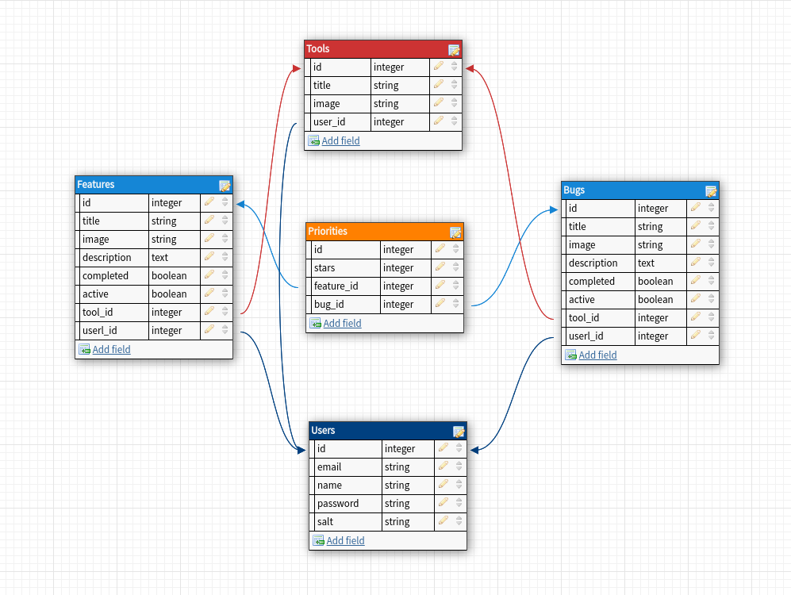

# Challenge Mercado Libre

## Cómo iniciar el proyecto?

```bash
git clone https://github.com/FacuEM/challenge-meli.git
```

### FRONT

```bash
cd challenge-meli/front
npm install
npm run build
```

### BACK

```bash
cd challenge-meli/back
npm install
npm start
```

---

## Tecnologías utilizadas:

- Database: Sqlite3
- ORM: Sequelize
- Back-end:
  - Node.js
  - Express.js
  - Passport.js (validaciones de usuario)
- Front-end;
  - React.js
  - React-redux
- Styles: Material UI

---

## Planificación del proyecto:

1.  Dibujo del flujo de interacciones del usuario con la aplicación.
2.  Diseño de la base de datos:
    1.  Elección de modelos.
    2.  Relaciones entre los mismos.



3.  Estructura de carpetas.

```
front
├── src
│   ├── /assets
│   ├── /aux
│   ├── /components
│   ├── /hooks
│   ├── /redux
│   │   ├── /actions
│   │   ├── /reducers
│   │   └── constants.js
│   ├── store.js
│   └── index.js
├── package.json
└── webpack.config.js
```

```
back
├── api
│   ├── /controllers
│   ├── /models
│   ├── /routes
│   └── db.js
│
│
├── public
│      └── index.html
├── challenge.db
├── index.js
└── package.json
```

4.  División de tareas por sprint (diarios: 4).

---

## Demo:

[](https://youtu.be/H5K-9igur-E)

Nota: Features que no aparecen en el video

> User deslogeado puede ver las herramientas, features y bugs pero no puede votar prioridad ni crear ninguna herramienta, feature o bug.

> Validación al logearse y al crear una nueva herramienta (nombre único).

> Bug del video solucionado: En la vista principal se mostraba como activo un feature y bug que no lo estaban.
